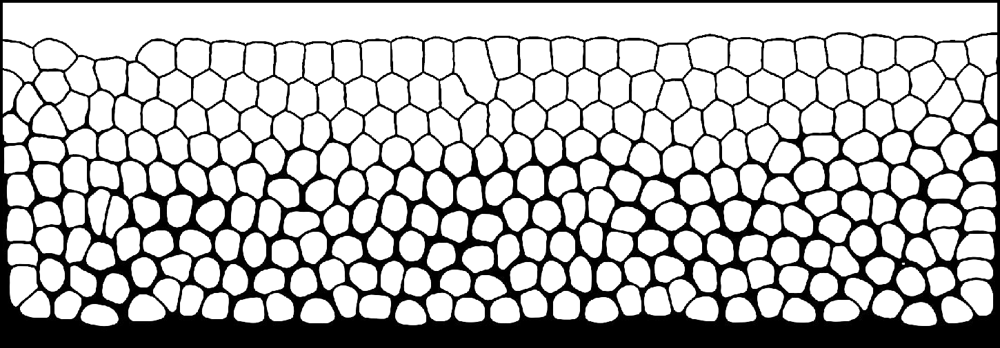

# Table of Contents

* [LBfoam](#lbfoam)
* [Installation](#installation)
* [Highlighted Features](#highlighted-features)
* [Directory and Code Structure](#directory-and-code-structure)
  + [Run an example](#run-an-example)
* [Getting help and bug report](#getting-help-and-bug-report)

# About LBfoam

LBfoam is an open-source CFD solver based on the lattice Boltzmann method for foaming simulations. The solver is an extended version of the [Palabos](https://palabos.unige.ch/) library.

The preprint is available [here](https://arxiv.org/abs/1908.04262), which is currently under review. 
# Highlighted Features

* 2D/3D Free Surface Lattice Boltzmann (FSLBM) solver
* Coupling of the Navier-Stokes equation and advection-dffisuion equation for the simulation bubble growth
* Implementation of bubble interaction using Piecewise Linear Interface Reconstruction (PLIC) and Ray Tracing algorithms
* Nucleating bubbles based on a nucleation probability field using the [Poisson-Disc Sampling](https://en.wikipedia.org/wiki/Poisson_sampling) algorithm
* Fully-parallelized using the [Message Passing Interface (MPI)](https://www.open-mpi.org/) library

# Directory and Code Structure

Figure below shows the directory structure of the LBfoam library.


The `algorithms` folder contains the PLIC, ray-tracing, Poisson disk-sampling algorithm, and other related functions. The `dynamics` folder contains the classes for advection-diffusion coupling and applying the Henry's law boundary condition. The `bubble` folder includes the classes for calculating gas diffusion into each bubble, updating bubble pressures, tracking bubble coalescence, calculation of disjoining pressure, and updating bubbles gas content. The `models` folder includes a 2D FSLBM model which is not available in Palabos. The directory `examples/lbfoam` include a variety of demo cases.

`lbfoam2D.h` and `lbfoam3D.h` header files provide access to LBfoam classes for 2D and 3D simulations, respectively. Each LBfoam function/class must be called using the namespace called `lbfoam` (e.g. `lbfoam::PLIC2D` ).

# Installation

LBfoam installation is very similar to the Palabos library and it does not depend on any external dependencies. LBfoam uses [ `Scons` ](https://scons.org/) build tool.

The mandatory packages for installation are `gcc` (or `clang` ), `make` , `python3` . For MPI parallel computations, `libopenmpi` library is required. To output results in `.gif` format, `imagemagick` library must be installed.

For Debian based distributions, the following command can install the required libraries.

``` 
$ sudo apt install gcc python3 make imagemagick libopenmpi-dev
```

Similar to Palabos the output of the simulations are in the form of `VTK` files, which can be visualized using the
of [Paraview](https://www.paraview.org/) software.

## Run an example

First, close the repository using the following git command:

``` 
$ git clone https://github.com/mehdiataei/LBfoam.git
```

Compile the `bucket2D` example:

``` 
$ cd examples/lbfoam/bucket2D
$ make
```

(Note: To compile the software on MacOS, uncomment the ` -DPLB_MAC_OS_X` compilation flag in the Makefile).

Run the example using the following command. The `bucket2D.xml` contains the simulation parameters.

``` 
$ ./bucket2D bucket2D.xml
```

To run the example in parallel using 8 cores for example:

``` 
$ mpirun -np 8 bucket2D bucket2D.xml
```

# Getting help and bug report

Please submit an issue of contact m.ataei@mail.utoronto.ca if you found a bug in the program or needed help with the software.
